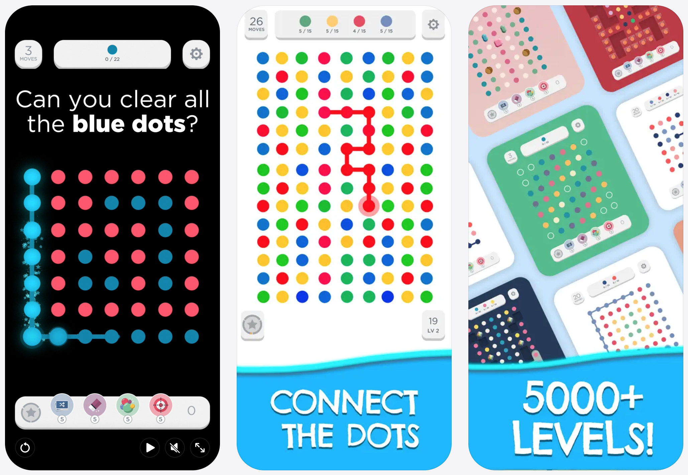

# Proyecto: Two Dots
*Lógica para Cs. de la Computación - 2026*

## El juego
El *Two Dots* es un juego de puzzle cuyo objetivo principal es conectar puntos del mismo color para eliminarlos, haciendo que nuevos puntos caigan por gravedad y permitiendo cumplir objetivos específicos de cada nivel. Se encuentra disponible para Android y iOS: [www.twodots-game.com/game](https://www.twodots-game.com/game)

## Requerimientos
### Funcionalidad
Se debe implementar una aplicación web que permita jugar al *Two Dots*, con una interfaz del estilo de las apps para Android y iOS.

Principales funcionalidades a ser contempladas:

- 📌 **Grilla de puntos de colores conectables.** El usuario debe poder seleccionar y conectar puntos adyacentes del mismo color para formar una jugada válida. Al completar la jugada, esos puntos desaparecen.

- 📌 **Caída por gravedad de nuevos puntos.** Luego de cada eliminación, los puntos por encima deben caer para ocupar espacios vacíos y deben generarse nuevos puntos en la parte superior para mantener la grilla completa.

- 📌 **Objetivos de la partida.** Cada nivel debe definir objetivos de cantidad de puntos eliminados por color, y el estado del juego debe reflejar el progreso en esos objetivos. En niveles con agua (ver requerimiento más abajo) también se puede establer como objetivo una cierta cantidad de agua a generar.

- 📌 **Formas cerradas (cuadrado o lazo cerrado).** Si una jugada forma una figura cerrada con puntos del mismo color, deben eliminarse todos los puntos de ese color presentes en la grilla.

- 📌 **Conversión a bombas al cerrar forma con contenido interno.** Si la forma cerrada encierra uno o más elementos en su interior, esos elementos deben convertirse en bombas.

- 📌 **Comportamiento de bombas.** Las bombas deben caer por gravedad como cualquier otro elemento y, al explotar, eliminar un área de 3×3 centrada en su posición.

- 📌 **Espacios / obstáculos.** Deben contemplarse casilleros especiales de tipo obstáculo o espacio no utilizable, que afecten la conectividad y/o la caída según las reglas que definan.

- 📌 **Mecánica de agua.** El agua se expande al eliminar puntos junto a ella. Además, un nivel puede tener como objetivo extender el agua una cierta cantidad de casilleros.

**Importante**: para cada uno de los requerimientos anteriores se debe imitar fielmente el comportamiento de la aplicación. Ante cualquier duda acerca de algún comportamiento específico, consultar con el docente asignado.

### Implementación
Debe extenderse la implementación molde (React + Prolog) en este repositorio para cumplir con los requerimientos de funcionalidad mencionados anteriormente.

El archivo [`init.pl`](./pengines_server/apps/proylcc/init.pl) (módulo Prolog) permite especificar la configuración de la partida o nivel, esto es, la grilla inicial y los objetivos, que será mostrada por la interfaz. Es **importante** que no se altere este esquema, y que se **conserve la representación** de la grilla propuesta en el código molde, dado que para la corrección del proyecto vamos a testear la implementación reemplazando la grilla actual en [`init.pl`](./pengines_server/apps/proylcc/init.pl) con diferentes grillas (casos de test).

El archivo [`proylcc.pl`](./pengines_server/apps/proylcc/proylcc.pl) contiene la implementación molde del predicado `connect/4` consultado desde la UI en React. Esto determina claramente qué parte de la resolución del juego queremos que se realice en Prolog, y qué parte en JS / React. En caso de necesitar modificar la interfaz de este predicado, o exportar predicados adicionales, consultarlo con el docente asignado.

### Documentación
Se deberá realizar un informe que explique claramente la **implementación en Prolog** realizada, así como los **aspectos destacados de la implementación en React**.
Además, deberá incluirse una sección con **casos de test** significativos (capturas de pantalla).

El informe debe ser:
- ✅ **Claro:** información bien estructurada y presentada.
- ✅ **Completo:** explicando cómo resolvieron cada requerimiento funcional (a nivel de estrategia, no a nivel de código), funcionalidades extra implementadas (si es que alguna), aspectos positivos de la resolución, desafíos que encontraron y cómo los enfrentaron, casos de test (capturas de pantalla).
- ✅ **Sintético y relevante:** no repetir información que está en el enunciado, no documentar funcionalidad de muy bajo nivel o auxiliar, que no contribuya al entendimiento de la estrategia principal.

**Consejo:** darle algunas pasadas (lectura y modificaciones) hasta conseguir todo esto.

El informe debe escribirse en [`INFORME.md`](/docs/INFORME.md).

### Comisiones y Entrega
1. Las comisiones deben estar conformadas por hasta **3 integrantes**, y ser previamente **registradas** en la página de la materia (Google sheet) y en la asignación de GH Classroom, lo que creará un repositorio GH privado accesible para los integrantes de la comisión y docentes (seguir indicaciones en la página de la materia).
2. A cada comisión se le **asignará un docente** de la práctica, quien hará el seguimiento y corregirá el proyecto de la comisión.
3. La **entrega** del proyecto se realiza mediante un **commit + push** de la versión final en el repositorio GH de la comisión.
4. La **fecha límite de entrega** del proyecto se encuentra publicada en la página de la materia. Los proyectos entregados fuera de término recibirán una penalización en su calificación, la cual será proporcional al retraso incurrido.

## Implementación molde en React + Prolog

Implementación molde a usar como punto de partida para la resolución del proyecto de la materia, usando React del lado del cliente para la UI, y Prolog del lado del servidor para la lógica del juego.

### Setup y ejecución del servidor Pengines
- [Descargar](https://www.swi-prolog.org/Download.html) e instalar el SWI-Prolog.

- Levantar el servidor ejecutando:

  `npm run pengines`

  La primera vez que se ejecute el run.pl se pedirá definir un username y un password para acceder a la consola web admin del servidor; elegir cualquiera (por ejemplo, username: 'lcc' y password: 'lccdcic'), pero no dejar vacíos.

- El servidor escuchará en http://localhost:3030

- Consola con configuraciones del servidor: http://localhost:3030/admin/server. Idealmente no necesitará acceder a ella.

- La carpeta `pengines_server/apps/proylcc` contiene el código Prolog del proyecto. Cada vez que se modifica este código es necesario bajar y volver a levantar el servidor para que se reflejen los cambios.

### Setup y ejecución de la aplicación React

- Descargar una versión reciente de [Node.js](https://nodejs.org/en/).

- Ejecutar

  `npm install`

  en el directorio del proyecto (`tic-tac-toe`) para instalar las dependencias (librerías) localmente, en la carpeta `node_modules`.

- Ejecutar

  `npm run dev`

  en el directorio del proyecto para correr la app en modo desarrollo.

- Abrir [http://localhost:3000](http://localhost:3000) para ver la aplicación en el browser.

- La página se refresca automáticamente cuando cambia el código.
